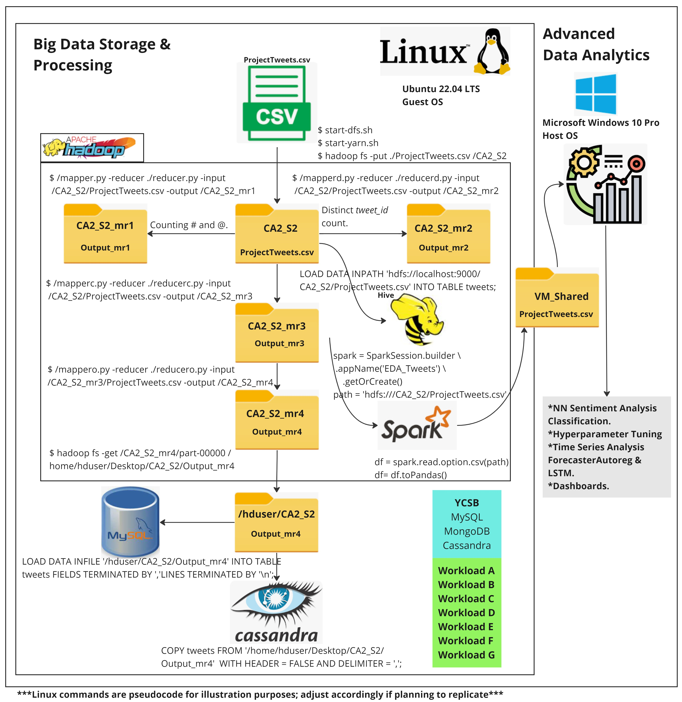

# Big Data Storage, Processing, and Advanced Data Analytics for Twitter Data

## Abstract
This project explores the use of Hadoop for data storage and processing, including tools like MapReduce, Spark, and Hive. Data storage is extended beyond the HDFS ecosystem using MySQL and Cassandra. YCSB is utilized for database performance benchmarking. Sentiment analysis with VADER, coupled with a multi-class neural network and time series analysis, reveals patterns and behaviors in text data. The dataset comprises tweets from April 6th to June 25th, 2009.



## Introduction
This project is divided into two main parts: Big Data and Advanced Data Analytics. The first section demonstrates Hadoop's database utilization and benchmarking. The second section focuses on sentiment analysis, time series analysis, and dashboard creation.

## Big Data
### Data Storage and Processing Activities
#### Storing ProjectTweets.csv in HDFS
```bash
# Start Hadoop services
start-dfs.sh
start-yarn.sh

# Create and manage Hadoop directories
hdfs dfs -rm -r /CA2_S2
hadoop fs -mkdir /CA2_S2

# Upload data to HDFS
hadoop fs -put ./ProjectTweets.csv /CA2_S2
```
## MapReduce Jobs

### Count and display mentions and hashtags
```bash
chmod 700 mapper.py
chmod 700 reducer.py
hadoop jar $HADOOP_HOME/share/hadoop/tools/lib/hadoop-streaming-3.3.6.jar -mapper ./mapper.py -reducer ./reducer.py -input /CA2_S2/ProjectTweets.csv -output /CA2_S2_mr1
```

### Distinct tweet_Id count
```bash
hadoop jar $HADOOP_HOME/share/hadoop/tools/lib/hadoop-streaming-3.3.6.jar -mapper ./mapperd.py -reducer ./reducerd.py -input /CA2_S2/ProjectTweets.csv -output /CA2_S2_mr2
```
### Cleaning tweets by removing commas and quotes
```bash
hadoop jar $HADOOP_HOME/share/hadoop/tools/lib/hadoop-streaming-3.3.6.jar -mapper ./mapperc.py -reducer ./reducerc.py -input /CA2_S2/ProjectTweets.csv -output /CA2_S2_mr3
```
### Ordering dataset based on IDs
```bash
hadoop jar $HADOOP_HOME/share/hadoop/tools/lib/hadoop-streaming-3.3.6.jar \
    -D mapreduce.job.output.key.comparator.class=org.apache.hadoop.mapred.lib.KeyFieldBasedComparator \
    -D stream.num.map.output.key.fields=2 \
    -D mapreduce.map.output.key.field.separator=, \
    -D mapreduce.partition.keycomparator.options="-k1,1n" \
    -files ./mappero.py,./reducero.py \
    -mapper mappero.py \
    -reducer reducero.py \
    -input /CA2_S2_NoCommas/part-00000 \
    -output /CA2_S2_Ordered
```
## Spark

```bash
from pyspark.sql import SparkSession

spark = SparkSession.builder.appName('EDA_Tweets').getOrCreate()
df = spark.read.option('csv', 'hdfs:///CA2_S2/ProjectTweets.csv').toPandas()

```
## Hive

#### Start Hive
```bash
cd /usr/local/hive/bin
./schematool -initSchema -dbType derby
hive
```
#### Hive commands
```bash
CREATE TABLE tweets (ids STRING, tweet_id STRING, `date` STRING, flag STRING, `user` STRING, `text` STRING) ROW FORMAT DELIMITED FIELDS TERMINATED BY '\054';
LOAD DATA INPATH 'hdfs://localhost:9000/CA2_S2/ProjectTweets.csv' INTO TABLE tweets;
SELECT COUNT(DISTINCT tweet_id) FROM tweets;
```
## MySQL

### Create table
```bash
CREATE TABLE tweets (
    ids text,
    tweet_id text,
    `date` VARCHAR(255),
    flag VARCHAR(255),
    `user` VARCHAR(255),
    `text` text
);
```
#### Move ProjectTweets.csv to 'secure_file_priv' otherwise it won't load
```bash
sudo mv /home/hduser/Desktop/CA2_S2/CleanTweets.csv /var/lib/mysql-files/
```
#### This command keeps a copy into the original directory
```bash
sudo cp /home/hduser/Desktop/CA2_S2/NoCommasProjectTweets.csv /var/lib/mysql-files/
```
#### Load data into MySQL table
```bash
LOAD DATA INFILE '/var/lib/mysql-files/NoCommasProjectTweets.csv'
INTO TABLE tweets
FIELDS TERMINATED BY ',' 
LINES TERMINATED BY '\n'
(ids, tweet_id, date, flag, user, text);
```
#### MySQL commands 
```bash
mysql -u root -p
show databases;
use BenchTest;
show tables;
delete from usertable;
```
## Cassandra

#### Find out Cassandra IP
```bash
hostname -I
```
#### Firing up Cassandra, let it run
```bash
cd /usr/local/cassandra/
bin/cassandra -f
```
#### In a different terminal
```bash
cd /usr/local/cassandra
bin/cqlsh
```
#### See keyspaces
```bash
DESCRIBE KEYSPACES;
```
#### Creating twitterdb keyspace and table 
```bash
CREATE KEYSPACE twitterdb WITH REPLICATION = { 'class' : 'SimpleStrategy', 'replication_factor' : 1 };
USE twitterdb;
CREATE TABLE tweets (
  ids text PRIMARY KEY,
  tweet_id text,
  date text,
  flag text,
  user text,
  text text
);
```
#### Copy tweets into Cassandra table
```bash
COPY twitterdb.tweets (ids, tweet_id, date, flag, user, text) 
FROM '/home/hduser/Desktop/CA2_S2/OrderedProjectTweets.csv' 
WITH HEADER = false AND delimiter = ',';
```
#### Create table with primary key
```bash
CREATE TABLE tweets(ids text, tweet_id text, date text, flag text, user text, text text, primary key (ids, tweet_id, date, flag, user, text));
```
#### Copy tweets into table
```bash
COPY tweets FROM '/home/hduser/Desktop/CA2_S2/OrderedProjectTweets.csv'  WITH HEADER
```
#### Select data from table
```bash
SELECT * FROM tweets LIMIT 100;
```
#### Delete and count records
```bash
TRUNCATE usertable;
SELECT count(*) FROM usertable;
```
## MongoDB

#### Start MongoDB 
```bash
mongod --bind_ip 127.0.0.1
```
#### MongoDB commands 
```bash
mongo
show dbs;
use ycsb;
show collections;
db.usertable.count();
db.usertable.find().limit(10);
db.dropDatabase();
```
## YCSB

### Setup YCSB for MySQL
```bash
cd /home/hduser/ycsb-0.17.0
cd workloads
```
#### Upload records to MySQL
```bash
./bin/ycsb.sh load jdbc -P ./jdbc-binding/conf/db.properties -P workloads/workloada
```
#### Run workloads for MySQL
```bash
./bin/ycsb.sh run jdbc -P workloads/workloada -P ./jdbc-binding/conf/db.properties
./bin/ycsb.sh run jdbc -P workloads/workloadb -P ./jdbc-binding/conf/db.properties
./bin/ycsb.sh run jdbc -P workloads/workloadc -P ./jdbc-binding/conf/db.properties
./bin/ycsb.sh run jdbc -P workloads/workloadd -P ./jdbc-binding/conf/db.properties
./bin/ycsb.sh run jdbc -P workloads/workloade -P ./jdbc-binding/conf/db.properties
./bin/ycsb.sh run jdbc -P workloads/workloadf -P ./jdbc-binding/conf/db.properties
./bin/ycsb.sh run jdbc -P workloads/workloadg -P ./jdbc-binding/conf/db.properties
```
### Setup YCSB for MongoDB

#### Upload records to MongoDB
```bash
./bin/ycsb.sh load mongodb -s -P workloads/workloada
```
#### Run workloads for MongoDB
```bash
./bin/ycsb.sh run mongodb -s -P workloads/workloada
./bin/ycsb.sh run mongodb -s -P workloads/workloadb
./bin/ycsb.sh run mongodb -s -P workloads/workloadc
./bin/ycsb.sh run mongodb -s -P workloads/workloadd
./bin/ycsb.sh run mongodb -s -P workloads/workloade
./bin/ycsb.sh run mongodb -s -P workloads/workloadf
./bin/ycsb.sh run mongodb -s -P workloads/workloadg
```
## Setup YCSB for Cassandra
#### Load records into Cassandra
```bash
./bin/ycsb.sh load cassandra-cql -p hosts=10.0.2.15,127.0.0.1 -p port=9042 -p debug=true -P workloads/workloada -s

```
#### Run workloads for Cassandra
```bash
./bin/ycsb.sh run cassandra-cql -p hosts=10.0.2.15,127.0.0.1 -p port=9042 -p debug=true -P workloads/workloada -s
./bin/ycsb.sh run cassandra-cql -p hosts=10.0.2.15,127.0.0.1 -p port=9042 -p debug=true -P workloads/workloadb -s
./bin/ycsb.sh run cassandra-cql -p hosts=10.0.2.15,127.0.0.1 -p port=9042 -p debug=true -P workloads/workloadc -s
./bin/ycsb.sh run cassandra-cql -p hosts=10.0.2.15,127.0.0.1 -p port=9042 -p debug=true -P workloads/workloadd -s
./bin/ycsb.sh run cassandra-cql -p hosts=10.0.2.15,127.0.0.1 -p port=9042 -p debug=true -P workloads/workloade -s
./bin/ycsb.sh run cassandra-cql -p hosts=10.0.2.15,127.0.0.1 -p port=9042 -p debug=true -P workloads/workloadf -s
./bin/ycsb.sh run cassandra-cql -p hosts=10.0.2.15,127.0.0.1 -p port=9042 -p debug=true -P workloads/workloadg -s
```
## Hive
#### Start Hadoop services first
```bash
start-dfs.sh
start-yarn.sh
```
#### Start Hive
```bash
cd /usr/local/hive/bin
./schematool -initSchema -dbType derby
hive
```
#### Handle Hive errors
```bash
rm -r metastore_db
```
#### Hive commands
```bash
CREATE TABLE IF NOT EXISTS tableHive (numRow int, name String, city String, county String, country String) ROW FORMAT DELIMITED FIELDS TERMINATED BY '\054';
LOAD DATA INPATH 'hdfs://localhost:9000/hive/pig_tutorial_sample.txt' INTO TABLE tableHive;
SELECT * FROM tableHive;
INSERT OVERWRITE LOCAL DIRECTORY '/home/hduser/export' ROW FORMAT DELIMITED FIELDS TERMINATED BY ',' SELECT * FROM tableHive;
INSERT OVERWRITE DIRECTORY 'hdfs://localhost:9000/hive/data/output/export' ROW FORMAT DELIMITED FIELDS TERMINATED BY ',' SELECT * FROM tableHive;
hadoop fs -cat /hive/data/output/export/*;
CREATE TABLE tweets (ids STRING, tweet_id STRING, `date` STRING, flag STRING, `user` STRING, `text` STRING) ROW FORMAT DELIMITED FIELDS TERMINATED BY '\054';
LOAD DATA INPATH 'hdfs://localhost:9000/CA2_S2/ProjectTweets.csv' INTO TABLE tweets;
DROP TABLE IF EXISTS tweets PURGE;
```
#### Count total rows and ount distinct rows from tweet_id
```bash
SELECT count(*) FROM tweets;
SELECT COUNT(DISTINCT tweet_id) FROM tweets;
```
# Advanced Data Analytics

## EDA (Exploratory Data Analysis)
The dataset was transferred to the Windows host machine for high computational tasks.

### Data Cleaning
The dataset contained 1685 duplicate records. Tweets were reordered chronologically from April 6, 2009, to June 25, 2009, for accurate time series analysis.

### Imbalanced Dataset
There were days without any recorded tweets, impacting time series analysis. Different approaches were taken to mitigate this issue, detailed in the Time Series Analysis section.

### Sentiment Analysis Strategy
Various sentiment analysis tools were considered, with VADER being chosen for its lower computational requirements. VADER scores range from -1 to 1:
- Scores > 0.05: Positive sentiment
- Scores < -0.05: Negative sentiment
- Scores between -0.05 and 0.05: Neutral sentiment

#### Average VADER Sentiment Score by Day of the Week
Sentiments were averaged and grouped by the day of the week. However, due to the imbalanced dataset, days with higher tweet frequencies showed biased average sentiments.

#### Hourly Average VADER Sentiment Score by Day of the Week
Tweets were averaged hourly to determine sentiment trends. The analysis showed that Twitter users were more positive on weekends, with sentiment peaking on Sundays and being lowest on Thursdays.

#### Key Dates and Events for Sentiment Change
VADER analysis required removing mentions and hashtags for accurate sentiment assignment. However, the original tweets were brought back post-analysis to understand sentiment fluctuations. Key positive influencers included musicians and events like #mothersday, while negative sentiment spiked during events like the 2009 Iranian presidential election riots.

### NN for Sentiment Classification
VADER scores were labeled into three categories: positive, negative, and neutral. A neural network with one input feature, three layers, and an output layer using softmax was trained, achieving 99.79% accuracy. Cross-validation confirmed this high performance.

### Hyperparameter Tuning Techniques
Various techniques were used to demonstrate model improvement.

#### Model NN with 1% of the Dataset
Using only 1% of the data, the model still performed well, showing that even a smaller dataset can yield high accuracy.

#### Adding More Features
Features like day_of_week, word_count, character_count, hashtag_count, and mention_count were added. The LGBM classifier achieved 100% accuracy, but vader_score remained the most important feature.

#### Reverse Engineering the Dataset
The target variable was shuffled, and 70% of vader_score values were set to zero, significantly reducing model accuracy and allowing for hyperparameter tuning.

#### Hyperparameter Tuning Using LGBM Classifier, Gradient Boosting Classifier, Gridsearch, and KFold Validation
These techniques improved model accuracy by 10%.

## Time Series Analysis
### Daily Time Series Analysis
The dataset's imbalance was addressed using interpolation and forward/backward filling methods to create a continuous trend line. However, the Dickey-Fuller test indicated non-stationarity and moderate predictability.

### Hourly Time Series Analysis
A 24-hour interval strategy was used for accurate predictions. The time series remained non-stationary with moderate predictability.

### Time Series Predictions Using ForecasterAutoreg
Initial predictions were made, and parameters were optimized using ParameterGrid, resulting in slight improvements.

### Time Series Predictions Using LSTM NN
An LSTM model was used for predictions, showing better results visually and quantitatively than ForecasterAutoreg, making it a suitable choice for non-stationary and imbalanced time series.

## Figures and Dashboards
Adhering to Tufte’s principles, data visualization focused on clarity and eliminating unnecessary elements. An interactive dashboard was created using Streamlit and can be visited at: https://ca2s2bigdatastorageprocessingadvanceddataanalytics.streamlit.app/

## Conclusion
- Hadoop, MapReduce, Spark, and Hive offer robust ecosystems for handling large files.
- MySQL excels in read capacity, while Cassandra is better suited for high write capacity.
- MongoDB outperformed MySQL and Cassandra in all scenarios tested.
- VADER effectively analyzed tweet sentiment, and with ForecasterAutoreg and LSTM NN, decent forecasts were made.
- Models with highly correlated features may need reverse engineering for hyperparameter tuning.

## How to Run This Project
1. Clone the repository to your local machine.
2. Ensure all dependencies are installed and Hadoop, Spark, and databases are properly configured.
3. Execute the provided scripts to start the data processing and analysis.
4. Review the analytics results generated by the scripts.


## License
This project is made available under the MIT License - see the [LICENSE.md](LICENSE.md) file for more details.
